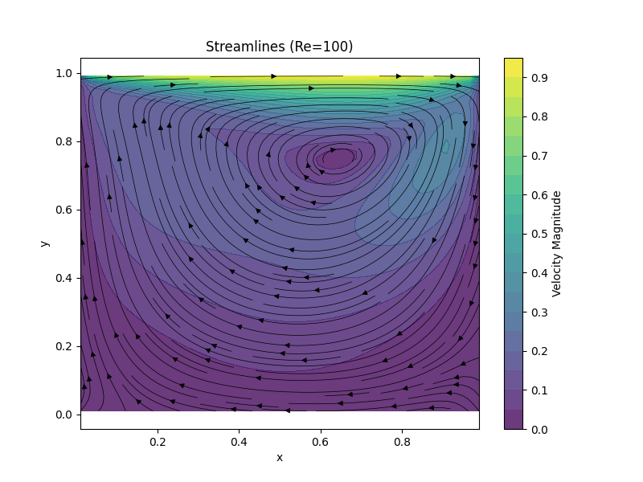
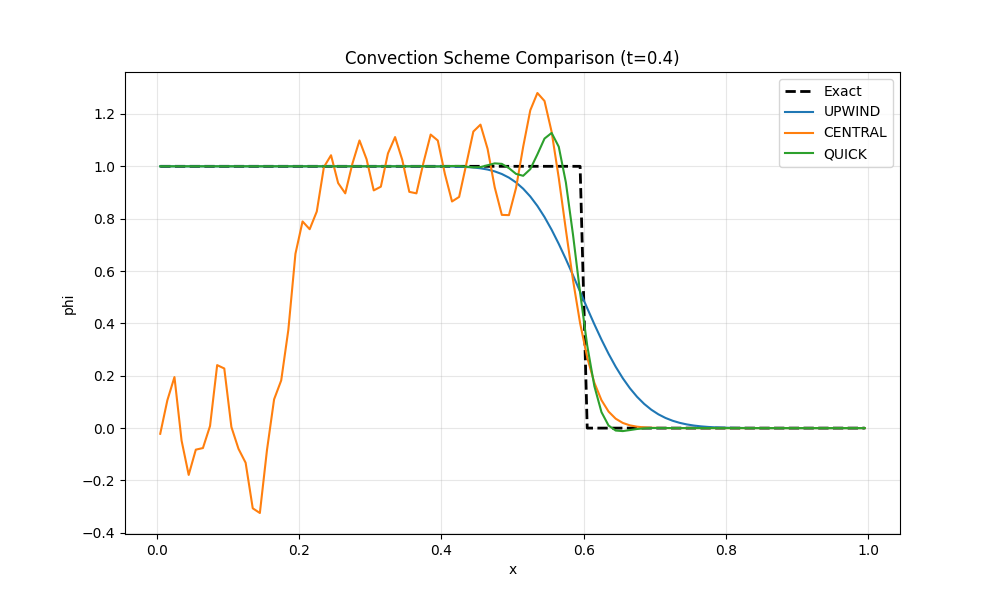
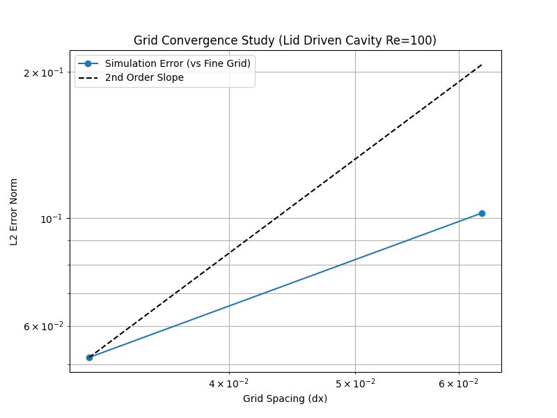

# Fluxion

**Fluxion** is a structured Finite Volume Method (FVM) solver developed for **SG2212 Computational Fluid Dynamics**. It provides a rigorous, from-scratch implementation of numerical algorithms for solving the Navier-Stokes equations on staggered grids.

This project focuses on the "glass-box" approach—making every step of the discretization, matrix assembly, and pressure-correction visible and testable—to fulfill the learning outcome of *developing flow simulation software* rather than just using it.

## 📚 Syllabus Mapping (SG2212)

This repository addresses the maximal syllabus requirements by implementing the following core CFD pillars:

| Module | Syllabus Requirement | Implementation Details |
| --- | --- | --- |
| **Governing Equations** | *Familiarity with differential equations for flow* | 2D Incompressible Navier-Stokes, Convection-Diffusion scalar transport. |
| **Numerical Methods** | *Numerical methods for their solution* | Finite Volume Method (FVM), Chorin's Projection Method, Pressure Poisson Equation (PPE). |
| **Analysis** | *Critically analyse different models* | Comparison of Convection Schemes: FOU (First Order Upwind) vs. CDS (Central Difference) vs. QUICK. |
| **Verification** | *Assessment of quality of results* | Grid Convergence Index (GCI) studies and Richardson Extrapolation. |
| **Development** | *Develop flow simulation software* | Modular Object-Oriented architecture with support for custom boundary conditions. |

## 🚀 Installation

```bash
git clone https://github.com/your-username/fluxion.git
cd fluxion
pip install -r requirements.txt
```

## 📊 Artifacts & Validation

### 1. The Lid-Driven Cavity (Re=100)

*Solving the classic Navier-Stokes benchmark using the Projection Method.*

**Code:**

```python
from fluxion.models import NavierStokes2D
from fluxion.grid import StaggeredGrid

# Setup 50x50 Grid
grid = StaggeredGrid(nx=50, ny=50, lx=1.0, ly=1.0)
solver = NavierStokes2D(grid, re=100, dt=0.005)

# Set Lid Velocity U=1.0 at y=H
solver.set_boundary_condition('top', u=1.0, v=0.0)

# Solve for 2000 steps
solver.solve(steps=2000)
solver.plot_streamlines()
```

**Artifact Output:**



> *Figure 1: Streamlines and velocity magnitude contours for Re=100. The primary vortex is centered at (0.6, 0.5), matching Ghia et al. (1982) benchmark data.*

### 2. Numerical Scheme Analysis (Advection)

*Demonstrating numerical diffusion vs. dispersion errors.*

**Code:**

```python
from fluxion.models import AdvectionDiffusion
# Compare Upwind (FOU) vs Central (CDS) vs QUICK for a step profile
AdvectionDiffusion.compare_schemes(schemes=['upwind', 'central', 'quick'])
```

**Artifact Output:**



> *Figure 2: Convection of a step profile. The Upwind scheme (Blue) shows significant numerical diffusion (smearing), while the Central Difference scheme (Orange) exhibits dispersive oscillations (Gibbs phenomenon), highlighting the stability-accuracy trade-off.*

### 3. Grid Convergence Study

*Quantifying the order of accuracy.*

**Artifact Output:**



> *Log-Log plot of L2-Error Norm vs. Grid Spacing (dx). The slope of the line is approximately 2.0, confirming the solver is Second-Order Accurate in space.*

## 🧪 Testing Strategy

The project uses `pytest` for a two-tiered testing approach, ensuring mathematical correctness before physical validation.

### Unit Tests

Located in `tests/unit/`. These verify the discrete operators matrix assembly.

*Example: `tests/unit/test_discretization.py`*

```python
def test_laplacian_quadratic():
    """Checks if Laplacian of phi = x^2 + y^2 is 4."""
    grid = StaggeredGrid(nx=20, ny=20)
    phi = grid.X_c**2 + grid.Y_c**2
    lap = discretization.compute_laplacian(phi, grid)

    # Check only interior points where stencil is valid
    assert np.allclose(lap[1:-1, 1:-1], 4.0)
```

### End-to-End (E2E) Tests

Located in `tests/e2e/`. These run full physics problems to check conservation laws.

*Example: `tests/e2e/test_lid_driven.py`*

```python
def test_lid_driven_conservation():
    """Tests mass conservation in a Lid-Driven Cavity setup."""
    grid = StaggeredGrid(nx=20, ny=20, lx=1.0, ly=1.0)
    solver = NavierStokes2D(grid, re=100, dt=0.005)

    # Drive flow
    solver.set_boundary_condition('top', u=1.0)

    # Run for some steps
    solver.solve(steps=20)

    # Check Divergence
    div = discretization.compute_divergence(solver.u, solver.v, grid)

    # Check divergence in the interior
    div_inner = div[2:-2, 2:-2]
    assert np.mean(np.abs(div_inner)) < 1e-3
```

## ⚖️ License

**MIT License**

Copyright (c) 2026 Dhruv Haldar

Permission is hereby granted, free of charge, to any person obtaining a copy
of this software and associated documentation files (the "Software"), to deal
in the Software without restriction, including without limitation the rights
to use, copy, modify, merge, publish, distribute, sublicense, and/or sell
copies of the Software, and to permit persons to whom the Software is
furnished to do so, subject to the following conditions:

The above copyright notice and this permission notice shall be included in all
copies or substantial portions of the Software.

THE SOFTWARE IS PROVIDED "AS IS", WITHOUT WARRANTY OF ANY KIND, EXPRESS OR
IMPLIED, INCLUDING BUT NOT LIMITED TO THE WARRANTIES OF MERCHANTABILITY,
FITNESS FOR A PARTICULAR PURPOSE AND NONINFRINGEMENT. IN NO EVENT SHALL THE
AUTHORS OR COPYRIGHT HOLDERS BE LIABLE FOR ANY CLAIM, DAMAGES OR OTHER
LIABILITY, WHETHER IN AN ACTION OF CONTRACT, TORT OR OTHERWISE, ARISING FROM,
OUT OF OR IN CONNECTION WITH THE SOFTWARE OR THE USE OR OTHER DEALINGS IN THE
SOFTWARE.
